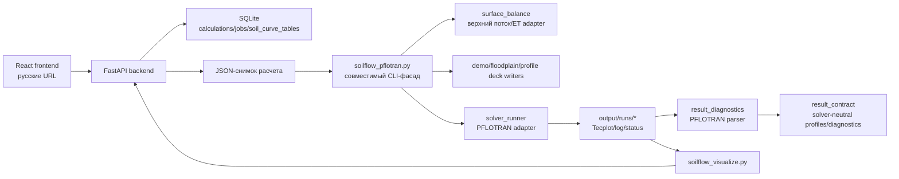

# Архитектура проекта

Документ фиксирует текущую модульную границу проекта `Влагоперенос в почве`.
Главный принцип: web/backend и CLI работают с расчетным JSON-снимком, а
физическая постановка, запуск solver-а и чтение результатов разделены на
заменяемые adapter-слои.

## Общий поток данных

## Основные модули

- `soilflow_pflotran.py` - совместимый CLI-фасад: читает JSON, выбирает режим,
  маршрутизирует demo/test/profile-сценарии.
- `demo_deck_writer.py` - стандартный PFLOTRAN `RICHARDS` deck для 1D/2D/3D.
- `floodplain_deck_writer.py` - специализированная постановка пойменного
  участка с двухслойной почвой, рекой и регулируемой дреной.
- `profile_carrier.py` - PFLOTRAN profile-carrier deck для расширенных
  аналитических benchmarks.
- `solver_runner.py` - текущий adapter запуска PFLOTRAN native/WSL.
- `surface_balance.py` - текущий adapter верхнего водного баланса:
  `precipitation + irrigation - epot`; транспирация пока сохраняется как
  входной контракт будущего root uptake.
- `result_diagnostics.py` - PFLOTRAN-oriented parser Tecplot/log/status.
- `result_contract.py` - нейтральный контракт результата для будущей замены
  solver-а или parser-а.
- `test_evaluation.py` - единая сборка `PASS/WARN/FAIL`, `UNKNOWN`,
  `PFLOTRAN_ERROR` и suite status.
- `test_registry.py` - реестр тестов, выбор `all`, рабочие пути и чтение
  сценариев из JSON, включая уровень проверки: `strict_analytical`,
  `partial_balance`, `profile_smoke`.
- `test_artifacts.py` - общие CSV/SVG artifacts и диагностика аналитического
  overlay.
- `profile_benchmarks.py` - профильные benchmark artifacts: `analytical_profiles.csv`,
  TECPLOT-ready status и profile-smoke diagnostics после запуска PFLOTRAN.

## Заменяемые границы

- `solver`: новый solver должен иметь собственный runner и parser-adapter, но
  возвращать данные в `result_contract`.
- `surface_balance`: новая ET/инфильтрационная модель должна сохранять weather
  contract или явно расширить forcing contract.
- `result_parser`: PFLOTRAN parser можно заменить, если новый parser возвращает
  profiles/diagnostics/status в нейтральном формате.
- `deck_writer`: новые физические постановки добавляются отдельными writer-
  модулями, а не внутрь CLI-фасада.

## Текущие ограничения

- Часть аналитических test deck/evaluator функций ещё остается в
  `soilflow_pflotran.py`; следующий крупный рефакторинг должен выделить
  `test_builders` и `test_evaluators`.
- Профильные benchmark overlay и TECPLOT-status уже вынесены в
  `profile_benchmarks.py`, но физические strict-evaluator'ы для них еще не
  подключены.
- Profile smoke тесты не считаются строгой верификацией: они проверяют
  генерацию PFLOTRAN-профиля и аналитического reference artifact, но не
  физическое совпадение с Theis/Ogata/Terzaghi/heat/Buckley и другими моделями.
- `result_contract.py` пока используется как явный контракт и покрыт тестом,
  но не является единственным runtime-путем визуализации.
- `surface_balance.py` реализует простую среднюю верхнюю flux-модель; полноценные
  ET/root uptake и многофакторный дождевой forcing должны подключаться отдельной
  моделью.
