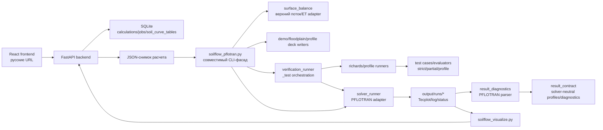

# Архитектура проекта

Документ фиксирует текущую модульную границу проекта `Влагоперенос в почве`.
Главный принцип: web/backend и CLI работают с расчетным JSON-снимком, а
физическая постановка, запуск solver-а и чтение результатов разделены на
заменяемые adapter-слои.

## Общий поток данных

## Основные модули

- `soilflow_pflotran.py` - совместимый CLI-фасад: читает JSON, выбирает режим,
  маршрутизирует demo-сценарии и передает `_test` в verification runner.
- `demo_deck_writer.py` - стандартный PFLOTRAN `RICHARDS` deck для 1D/2D/3D.
- `floodplain_deck_writer.py` - специализированная постановка пойменного
  участка с двухслойной почвой, рекой и регулируемой дреной.
- `profile_carrier.py` - PFLOTRAN profile-carrier deck для расширенных
  аналитических benchmarks.
- `solver_runner.py` - текущий adapter запуска PFLOTRAN native/WSL.
- `surface_balance.py` - текущий adapter верхнего водного баланса:
  `precipitation + irrigation - epot`; транспирация пока сохраняется как
  входной контракт будущего root uptake.
- `result_diagnostics.py` - PFLOTRAN-oriented parser Tecplot/log/status.
- `result_contract.py` - нейтральный контракт результата для будущей замены
  solver-а или parser-а.
- `test_evaluation.py` - единая сборка `PASS/WARN/FAIL`, `UNKNOWN`,
  `PFLOTRAN_ERROR` и suite status.
- `test_suite_artifacts.py` - запись suite summary в TXT/JSON/CSV artifacts
  для машинного анализа verification-suite.
- `test_registry.py` - реестр тестов, выбор `all`, рабочие пути и чтение
  сценариев из JSON, включая уровень проверки: `strict_analytical`,
  `partial_balance`, `profile_smoke`.
- `test_artifacts.py` - общие CSV/SVG artifacts и диагностика аналитического
  overlay.
- `profile_benchmarks.py` - профильные benchmark artifacts: `analytical_profiles.csv`,
  TECPLOT-ready status, profile-smoke diagnostics и reference overlay метрики
  после запуска PFLOTRAN.
- `richards_test_cases.py` - параметры, PFLOTRAN deck'и и analytical artifacts
  для strict/partial Richards verification tests.
- `richards_test_evaluators.py` - strict/partial numerical-vs-analytical
  сравнения PFLOTRAN профилей, solver diagnostics и `TEST_STATUS.txt`.
- `richards_test_runner.py` - запуск strict/partial Richards verification:
  artifacts, solver и выбор evaluator-а.
- `profile_test_runner.py` - запуск profile-smoke benchmark'ов:
  reference artifacts, profile-carrier deck, solver и TECPLOT-ready status.
- `test_solver_execution.py` - общий execution-helper для native/WSL PFLOTRAN
  запуска внутри verification runners и единая обработка отсутствующего solver-а.
- `verification_runner.py` - suite-router режима `_test`: чтение JSON, выбор
  сценариев, рабочие папки и suite status.

## Заменяемые границы

- `solver`: новый solver должен иметь собственный runner и parser-adapter, но
  возвращать данные в `result_contract`.
- `surface_balance`: новая ET/инфильтрационная модель должна сохранять weather
  contract или явно расширить forcing contract.
- `result_parser`: PFLOTRAN parser можно заменить, если новый parser возвращает
  profiles/diagnostics/status в нейтральном формате.
- `deck_writer`: новые физические постановки добавляются отдельными writer-
  модулями, а не внутрь CLI-фасада.

## Текущие ограничения

- Strict/partial Richards test deck/evaluator функции, family runners и suite-router `_test`
  вынесены из `soilflow_pflotran.py`; CLI-фасад больше не содержит
  generation/run/evaluate логику verification-suite.
- Профильные benchmark overlay и TECPLOT-status уже вынесены в
  `profile_benchmarks.py`, а диагностическая оценка reference overlay - в
  `profile_benchmark_evaluators.py`. Машинно-читаемая карта физических семейств,
  готовности carrier deck'ов и blocker'ов strict evaluator'ов вынесена в
  `profile_benchmark_cases.py`; физические strict-evaluator'ы для них еще не
  подключены.
- Profile smoke тесты не считаются строгой верификацией: они проверяют
  генерацию PFLOTRAN-профиля и аналитического reference artifact, но не
  физическое совпадение с Theis/Ogata/Terzaghi/heat/Buckley и другими моделями.
  Для них пишутся диагностические `REFERENCE_OVERLAY` ошибки по профилю,
  инженерный `profile_overlay_quality_check`, pending-статус strict evaluator,
  физическое семейство и статус carrier deck'а. Эти ошибки пока не являются
  strict PASS/FAIL критерием. Подробные пары
  `PFLOTRAN vs analytical` сохраняются в `profile_overlay_comparison.csv`.
- Suite status пишется в трех форматах: человекочитаемый
  `TEST_SUITE_STATUS.txt`, машинный `TEST_SUITE_STATUS.json` и табличный
  `TEST_SUITE_RESULTS.csv`.
- `result_contract.py` пока используется как явный контракт и покрыт тестом,
  но не является единственным runtime-путем визуализации.
- `surface_balance.py` реализует простую среднюю верхнюю flux-модель; полноценные
  ET/root uptake и многофакторный дождевой forcing должны подключаться отдельной
  моделью.
