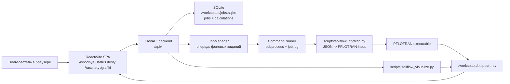
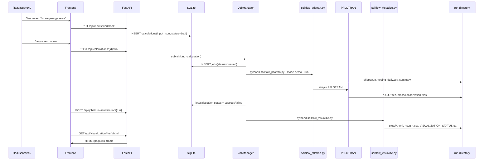

# Внешний контекст проекта

**Проект:** Влагоперенос в почве
**Папка проекта:** `/home/zenbook/SF/pflotran_soilflow_docker_tested`
**Папка git-репозитория:** `/home/zenbook/SF`
**Дата фиксации контекста:** 2026-06-28
**Назначение файла:** восстановить состояние разработки в новом чате Codex без потери архитектурного контекста.

## 1. Краткое состояние

Проект представляет собой Docker-комплект и web-интерфейс для подготовки, запуска и анализа расчетов влагопереноса в почве на базе PFLOTRAN. Текущая целевая постановка расширилась от 1D демонстрационного уравнения Ричардса до 2D XY/XZ расчетов, аналитических тестов и исследовательской задачи управляемого дренажа пойменного участка.

Актуальный web-сервис запущен в Docker:

```text
Контейнер: pflotran_soilflow_docker_tested-soilflow-web-1
Образ: soilflow-pflotran:local
URL: http://localhost:18080/
Порт контейнера: 8080
Рабочая папка внутри контейнера: /workspace
Код приложения внутри контейнера: /opt/soilflow
PFLOTRAN: /opt/pflotran/src/pflotran/pflotran
Режим авторизации сейчас: SOILFLOW_AUTH_MODE=none
```

Важно: после последнего stability/performance инкремента образ
`soilflow-pflotran:local` был полностью пересобран и контейнер пересоздан.
Для следующих значимых изменений повторять rebuild gate, чтобы не возвращаться к
режиму hot-copy как к источнику истины.

## 2. Главные архитектурные решения

1. PFLOTRAN остается внешним расчетным ядром, а проект хранит свою предметную структуру в Python/JSON/SQLite и генерирует PFLOTRAN input deck.
2. XLSX больше не является внутренним этапом подготовки данных. XLSX допускается только как формат вывода/экспорта проекта или исторический артефакт.
3. Пользовательские исходные данные сохраняются в SQLite как записи `расчет №...` с timestamp, JSON-снимком параметров, статусом, связью с job и папкой результатов.
4. Web-интерфейс работает как SPA на React/Vite, а backend на FastAPI обслуживает API, static frontend, файлы результатов и HTML-графики.
5. Долгие операции запускаются как фоновые задания через `JobManager` и `ThreadPoolExecutor`; состояние заданий хранится в SQLite.
6. Визуализация отделена от расчета: `soilflow_pflotran.py` генерирует и запускает расчет, `soilflow_visualize.py` читает TECPLOT/CSV и строит HTML/SVG/CSV графические артефакты.
7. Для безопасности backend валидирует имена расчетов, job id, пути к файлам, размер API body, прямые file responses и архивы; добавлены CSP/security headers, rate-limit и опциональный Bearer-token режим.
8. SQLite schema version 2 содержит табличные экспериментальные кривые почвы: `soil_curve_tables` и `soil_curve_points`; backend API и frontend-редактор доступны на странице `Исходные данные`.
9. Страница `Тесты` содержит workflow `Табличная почва`: он создает расчет в SQLite, сохраняет демо-кривые Pc(S)/kr(S), запускает PFLOTRAN и затем строит графики.
10. Полный API-контур табличной почвы закреплен в `scripts/api_tabular_workflow_smoke.sh` и включен в `scripts/check_project.sh`; smoke удаляет созданный расчет, если не задано `KEEP_TABULAR_API_SMOKE=1`.
11. Performance/stability контур results API закреплен в `scripts/api_results_performance_smoke.sh`: smoke создает временные run-папки, делает restart web-сервиса, проверяет summary/detail/status/plots endpoints, HTML-график, лимиты времени ответа и размера payload, отказ прямого чтения symlink-файла, затем очищает временные данные.
12. Restart-resilience контур закреплен в `scripts/api_restart_resilience_smoke.sh`: smoke создает временный queued job напрямую в SQLite, перезапускает web-сервис, проверяет перевод job в `failed`, readiness/schema version и базовые API, затем очищает временную запись.
13. Verification/runtime timeout policy закреплена в коде: web jobs по `SOILFLOW_JOB_TIMEOUT_SECONDS` получают exit code `124` и `[TIMEOUT]` в log, CLI/PFLOTRAN runner поддерживает `--solver-timeout-seconds`/`SOILFLOW_SOLVER_TIMEOUT_SECONDS`, а verification-suite пишет `PFLOTRAN_TIMEOUT`.
14. Verification-suite status artifacts содержат `failure_stage=generation|solver|parser|evaluator`, чтобы suite CSV/API отличали сбой подготовки входных файлов, внешнего solver-а, разбора TECPLOT/profile output и физической оценки.
15. Для быстрых итераций добавлен профиль `CHECK_PROFILE=fast ./scripts/check_project.sh` и Makefile-цель `project-check-fast`; полный gate остается `CHECK_PROFILE=full ./scripts/check_project.sh` или обычный `project-check`.
16. Для исследовательских прогонов добавлен `CHECK_PROFILE=research ./scripts/check_project.sh` и Makefile-цель `project-check-research`; по умолчанию это dry-run verification-suite, а solver-run включается через `RESEARCH_DRY_RUN=0`.

## 3. Карта каталогов

```text
pflotran_soilflow_docker_tested/
  Dockerfile
  docker-compose.yml
  Makefile
  CHANGELOG.md
  README_*.md
  THIRD_PARTY_NOTICE_RU.md

  input/
    soilflow_pflotran_demo.json      актуальный JSON-шаблон исходных данных
    soilflow_pflotran_demo.xlsx      исторический/выводной формат, не внутренняя БД

  scripts/
    soilflow_pflotran.py             совместимый CLI-фасад: чтение JSON, demo-mode, передача _test в verification_runner
    soilflow_visualize.py            HTML/SVG/CSV визуализация 1D/XY/XZ профилей
    check_project.sh                 единая проверка с профилями fast/full: Python compile, unit, frontend build, restart, API/performance/UI smoke
    api_smoke.sh                     read-only проверка базового API-контракта живого web-сервиса
    ui_route_smoke.sh                read-only проверка коротких frontend URL и SPA/API fallback
    sync_to_running_container.sh     документированный hot-copy workflow для запущенного контейнера
    soilflow_pflotran_modules/       вынесенные контракты parser/model/deck/floodplain/result diagnostics/result contract/solver runner/surface balance/test evaluation/test runners
    *.sh                             вспомогательные Docker-команды

  web/backend/app/
    main.py                          FastAPI app, middleware, routers, static SPA
    config.py                        настройки окружения и workspace
    job_store.py                     SQLite-хранилище jobs/calculations + schema_migrations + soil_curve_* tables
    job_lifecycle.py                 единые статусы job/calculation lifecycle
    job_manager.py                   очередь и запуск фоновых subprocess
    file_manager.py                  безопасная работа с путями и zip
    routers/                         API endpoints, включая /api/soil-curves
    services/                        CLI, JSON-снимки, архивы, логи, runner, readers status-сводок тестов

  web/frontend/src/
    App.tsx                          SPA router
    routes.ts                        русские короткие URL
    api/client.ts                    клиент API, token/session/cookie для графиков
    pages/                           страницы интерфейса
    components/                      layout, прогресс, логи, графики, файлы
    styles.css                       основной CSS

  docs/
    EXTERNAL_CONTEXT_RU.md           этот файл
    ANALYTICAL_TESTS_RU.md           аналитические тесты
    WEB_INTERFACE_RU.md              web-интерфейс
    API_CONTRACT_RU.md               публичный backend API-контракт, статусы и legacy endpoints
    SCHEMA_ALGORITHM_COMPONENTS_RU.md
    schema_*.dot/png/svg             существующие схемы

  output/runs/                       generated результаты расчетов, исключены из git
```

Результаты расчетов считаются generated artifacts и не должны попадать в git. В работающем контейнере результаты и база находятся в Docker volume `/workspace`:

```text
/workspace/input/
/workspace/output/runs/
/workspace/jobs/
/workspace/archives/
/workspace/tmp/
/workspace/jobs.sqlite
```

## 4. Архитектурная схема верхнего уровня



## 5. Поток данных расчета



## 6. Backend

### 6.1 Точка входа

`web/backend/app/main.py`:

- создает `FastAPI`;
- загружает `Settings`;
- создает `FileManager`, `JobStore`, `JobManager`;
- при старте помечает незавершенные `queued/running` задания как прерванные;
- подключает routers;
- отдает собранный frontend из `web/frontend/dist`;
- добавляет middleware авторизации, rate-limit, лимита body и security headers.
- `GET /api/health` остается быстрым liveness endpoint.
- `GET /api/health/ready` проверяет PFLOTRAN, workspace/tmp, frontend dist и SQLite schema version.

### 6.2 Конфигурация

`web/backend/app/config.py` читает переменные окружения:

```text
SOILFLOW_HOME=/opt/soilflow
SOILFLOW_WORKSPACE=/workspace
PFLOTRAN_EXE=/opt/pflotran/src/pflotran/pflotran
PORT=8080
JOB_WORKERS=1
SOILFLOW_AUTH_MODE=none|token
SOILFLOW_API_TOKEN=<token>
SOILFLOW_MAX_ARCHIVE_MB=2048
SOILFLOW_MAX_ARCHIVE_FILES=20000
SOILFLOW_JOB_TIMEOUT_SECONDS=21600
SOILFLOW_API_RATE_LIMIT_PER_MINUTE=120
SOILFLOW_MAX_JSON_BODY_KB=512
SOILFLOW_ENABLE_API_DOCS=false
SOILFLOW_ENABLE_HSTS=false
```

`ensure_workspace()` создает рабочие директории и копирует bundled JSON-шаблон в `/workspace/input/soilflow_pflotran_demo.json`, если пользовательского файла еще нет.

### 6.3 SQLite-хранилище

`web/backend/app/job_store.py` создает две таблицы:

```text
jobs(
  id TEXT PRIMARY KEY,
  kind TEXT,
  status TEXT,
  command_json TEXT,
  run_name TEXT,
  created_at TEXT,
  started_at TEXT,
  finished_at TEXT,
  exit_code INTEGER,
  log_path TEXT,
  output_dir TEXT,
  error_message TEXT,
  calculation_id INTEGER
)

calculations(
  id INTEGER PRIMARY KEY AUTOINCREMENT,
  title TEXT UNIQUE,                 "расчет №<id>"
  created_at TEXT,
  updated_at TEXT,
  input_json TEXT,                   полный JSON-снимок исходных данных
  run_name TEXT UNIQUE,
  job_id TEXT,
  status TEXT,
  result_dir TEXT
)
```

Текущие статусы: `draft`, `queued`, `running`, `success`, `failed`, `cancelled`.

При удалении расчета запись удаляется из `calculations`, а у связанных jobs поле `calculation_id` обнуляется. В интерфейсе также предусмотрено удаление папки результатов внутри `output/runs`.

### 6.4 API routers

```text
/api/health
  GET ""                               health-check

/api/system
  GET /info                            параметры окружения и доступность PFLOTRAN/frontend

/api/projects
  GET/POST/GET {id}                    пока один default project

/api/inputs
  GET /workbook                        текущий/последний workbook из SQLite или seed JSON
  PUT /workbook                        сохраняет workbook как новый расчет
  POST /reset                          сбрасывает форму к bundled JSON

/api/calculations
  GET "" ?q=...                        поиск расчетов
  GET /{id}                            расчет + input workbook
  DELETE /{id}                         удаление расчета
  POST /{id}/run                       запуск сохраненного расчета

/api/jobs
  POST /run-demo                       demo расчет
  POST /run-test-suite                 весь набор тестов
  POST /run-test/{test_name}           отдельный тест
  POST /run-visualization/{run_name}   построение графиков
  POST /run-custom                     legacy/custom запуск
  GET ""                               список заданий
  GET /{job_id}                        карточка задания
  GET /{job_id}/log                    лог задания
  POST /{job_id}/cancel                отмена

/api/results
  GET /runs                            список run-директорий
  GET /runs/{run_name}                 информация по run
  GET /runs/{run_name}/status          статус
  GET /runs/{run_name}/plots           файлы графиков
  GET /runs/{run_name}/file/{path}     файл результата

/api/files
  GET /download-zip/{run_id}           zip архива run
  GET /{path}                          безопасная отдача публичных workspace-файлов

/api/visualization
  GET /{run_name}/html                 интерактивный HTML-график
  GET /{run_name}/status               VISUALIZATION_STATUS.txt
```

### 6.5 Безопасность backend

Уже реализовано:

- `safe_run_name()` ограничивает имена расчетов регулярным выражением и запрещает `..`;
- `safe_resolve_under()` запрещает absolute path и выход за базовую папку;
- zip-архивы пропускают symlink и ограничены по размеру/числу файлов;
- job id валидируется как hex UUID без дефисов;
- API body ограничен;
- API rate-limit по IP в памяти процесса;
- CSP, `X-Content-Type-Options`, `Referrer-Policy`, `X-Frame-Options`, `Permissions-Policy`, COOP/CORP;
- FastAPI docs/OpenAPI выключены по умолчанию;
- Bearer token включается через `SOILFLOW_AUTH_MODE=token`;
- токен API удаляется из окружения дочерних расчетных процессов.

Ограничения:

- rate-limit in-memory, при нескольких worker/process он не общий;
- нет пользователей, ролей и разграничения проектов;
- SQLite не имеет миграционного слоя, схема обновляется вручную через `CREATE TABLE IF NOT EXISTS`/`ALTER TABLE`;
- token auth подходит для локального/закрытого использования, не для полноценного multi-user SaaS.

## 7. Frontend

Frontend: React + TypeScript + Vite без отдельного UI-фреймворка.

Главные файлы:

```text
web/frontend/src/App.tsx
  простой SPA-router по pathname, без react-router

web/frontend/src/routes.ts
  короткие русские URL:
    /                       Обзор
    /ishodnye               Исходные данные
    /status                 Статус
    /testy                  Тесты
    /raschety               Расчеты
    /grafiki                Графики
    /sistema                Система
  legacy alias-адреса удалены, неизвестные frontend пути ведут на "Обзор"

web/frontend/src/api/client.ts
  fetch-wrapper, Bearer token, sessionStorage, cookie для iframe-графиков

web/frontend/src/components/Layout.tsx
  боковая панель, навигация, прогресс задач, переход в "Статус"

web/frontend/src/pages/InputsPage.tsx
  многовкладочная форма исходных данных, сохранение в SQLite,
  подстановка параметров выбранного расчета, валидация пар моделей почвы

web/frontend/src/pages/JobsPage.tsx
  список заданий, auto-refresh, оценка оставшегося времени

web/frontend/src/pages/ResultsPage.tsx
  поиск расчетов, удаление, просмотр результатов без пересчета,
  переход к графикам выбранного расчета

web/frontend/src/pages/TestsPage.tsx
  тесты в раскрывающихся группах, запуск отдельного теста,
  автозапуск визуализации после расчета

web/frontend/src/testDefinitions.ts
  предметные описания аналитических и verification-тестов; UI-страница
  остается слоем workflow и представления

web/frontend/src/pages/VisualizationPage.tsx
  выбор run, запуск визуализации, iframe HTML-графиков, список файлов
```

Интерфейс должен оставаться полностью русскоязычным. Видимое название проекта: `Влагоперенос в почве`.

Особые UX-требования, уже заложенные в текущей версии:

- на странице исходных данных строки параметров имеют три колонки: имя переменной, поле ввода умеренной ширины, комментарий на русском;
- имена переменных не должны переноситься на вторую строку;
- размерности перенесены из имени переменной в комментарий;
- прогресс задач виден в левой панели, чтобы пользователь понимал, что сайт не завис;
- графики должны иметь читаемые оси, светлую сетку, без дублирования подписей и наложений;
- скорость проигрывания графиков задается логарифмическим ползунком от `0.1x` до `1000x`.

## 8. Расчетный слой: CLI-фасад и модули PFLOTRAN

`soilflow_pflotran.py` оставлен совместимым CLI-фасадом. Сейчас он выполняет
только верхнюю маршрутизацию и demo-mode:

1. читает JSON workbook;
2. извлекает параметры и weather rows;
3. валидирует пару моделей водоудерживания/влагопроводности;
4. строит structured grid для 1D, 2D_XY, 2D_XZ и частично 3D;
5. генерирует PFLOTRAN input deck;
6. пишет вспомогательные CSV/summary;
7. запускает PFLOTRAN для demo/пользовательских расчетов;
8. передает режим `_test` в `soilflow_pflotran_modules.verification_runner`.

Verification-suite разделен на модули:

- `test_registry.py`: реестр тестов, выбор `all`, рабочие пути и уровень
  проверки (`strict_analytical`, `partial_balance`, `profile_smoke`);
- `richards_test_cases.py`: dataclass-параметры, PFLOTRAN deck'и и
  аналитические artifacts strict/partial Richards-тестов;
- `richards_test_evaluators.py`: сравнение PFLOTRAN-профилей с аналитикой и
  запись `TEST_STATUS.txt`;
- `profile_benchmarks.py`: profile-smoke overlay, TECPLOT-ready status и
  диагностические `REFERENCE_OVERLAY` ошибки по профилю;
- `profile_benchmark_cases.py`: физические семейства profile benchmark'ов,
  готовность carrier deck'ов, `profile_case_manifest.json`,
  `profile_strict_plan.json` и blocker'ы будущих strict evaluator'ов;
- `profile_benchmark_evaluators.py`: инженерная оценка качества reference
  overlay и явный pending-статус будущего strict evaluator;
- `profile_strict_evaluators.py`: strict-кандидаты profile benchmark'ов; сейчас
  есть диагностический evaluator для `richards_mms`;
- `richards_mms_case.py`: uniform storage `SOURCE_SINK` candidate deck,
  initial/source artifacts, cell-wise MMS residual table и matrix/manifest
  artifacts с shape/schema validation для следующего шага к PFLOTRAN spatial
  source adapter;
- `richards_test_runner.py`: запуск strict/partial Richards-сценариев;
- `profile_test_runner.py`: запуск profile-smoke benchmark'ов;
- `test_solver_execution.py`: общий native/WSL PFLOTRAN execution-helper для
  verification runners;
- `test_suite_artifacts.py`: запись suite summary в TXT/JSON/CSV для анализа;
- `verification_runner.py`: suite-router `_test`, выбор сценариев, рабочие
  папки и запись suite status.

Поддержанные типы сетки:

```text
1D:
  nx=1, ny=1, nz>1
  вертикальная колонка по Z

2D_XY:
  nx>1, ny>1, nz=1
  плановая сетка, один слой по Z
  поддержаны боковые давления WEST/EAST/SOUTH/NORTH

2D_XZ:
  nx>1, ny=1, nz>1
  вертикальный разрез

3D:
  архитектурно частично заложен через structured GRID,
  но пользовательские сценарии и визуализация пока сфокусированы на 1D/2D.
```

Поддержанные пары моделей почвы:

```text
retention_model=van_genuchten + conductivity_model=mualem
retention_model=van_genuchten + conductivity_model=burdine
retention_model=van_genuchten + conductivity_model=tabular
retention_model=brooks_corey + conductivity_model=mualem
retention_model=brooks_corey + conductivity_model=burdine
retention_model=brooks_corey + conductivity_model=tabular
retention_model=tabular + conductivity_model=tabular
```

Зарезервированные, но не полностью проверенные варианты:

```text
retention_model=gardner
conductivity_model=gardner
пара "Голованов-Аверьянов" / экспоненциальное водоудерживание + степенная влагопроводность
```

Специализированная постановка `scenario_type=floodplain_controlled_drainage`:

- 2D XZ представительская полоса между дренами;
- верхний слой торфяно-болотной почвы толщиной около 0.6 м;
- нижний слой песка толщиной около 2 м;
- нижняя граница как водоупор;
- река задается боковым Dirichlet head;
- закрытая дрена представлена как `SOURCE_SINK` с `PRESSURE_REGULATED_MASS_RATE VOLUME`;
- управляемый колодец пока схематизирован через контрольный напор и пропускную способность, а не как явная pipe-network модель.

## 9. Визуализация: `soilflow_visualize.py`

Скрипт читает TECPLOT output PFLOTRAN и аналитические CSV, затем создает:

```text
plots/profiles_animation.html
plots/profile_frames_long.csv
plots/profile_summary.csv
plots/profile_theta_h_tNNNN.svg
plots/VISUALIZATION_STATUS.txt
```

Для 2D:

```text
XY:
  plots/xy_map_frames_long.csv
  plots/xy_map_summary.csv
  plots/xy_map_theta_h_tNNNN.svg
  visualization_type=xy_map

XZ:
  plots/xz_map_frames_long.csv
  plots/xz_map_summary.csv
  plots/xz_map_theta_h_tNNNN.svg
  visualization_type=xz_map
```

Поведение:

- 1D профили показывают PFLOTRAN и аналитику на одном графике с легендой;
- по оси влажности не показывается отрицательная полуплоскость;
- надпись давления в интерфейсе: `Давление почвенной влаги`;
- для всех расширенных benchmark'ов добавлен PFLOTRAN `RICHARDS` profile carrier и `analytical_profiles.csv`, чтобы после запуска были расчетные TECPLOT-профили для графиков;
- статус profile-тестов содержит `analytical_overlay_check`, источник аналитического профиля и число точек overlay;
- для heat/transport/groundwater benchmark'ов дополнительно пишутся `profile_case_builder_manifest.json` и `pflotran_*_candidate.in`, чтобы зафиксировать будущий physics adapter, parser contract и evaluator contract;
- для неричардсовых benchmark'ов профиль пока является нормированным carrier-сравнением, а не строгой численной постановкой transport/heat/two-phase/groundwater физики.

## 10. Аналитические и verification-тесты

Список тестов, известных backend:

```text
linear_darcy
hydrostatic_vg_no_flow
unit_gradient_unsat
transient_uniform_storage_vg
brooks_corey_burdine
theis_radial_flow
ogata_banks_1d_transport
terzaghi_1d_consolidation
philip_infiltration
green_ampt_infiltration
heat_conduction_1d
buckley_leverett
richards_mms
boussinesq_groundwater_mound
```

В интерфейсе тесты разделены на группы:

- служебный запуск;
- 1D и пространственно-однородные benchmark-задачи;
- 2D/радиальные/профильные benchmark-задачи.

Часть расширенных аналитических тестов пока остается эталонной аналитикой без полноценного PFLOTRAN deck. Для релизного качества нужно довести все такие тесты до статуса, где численный профиль PFLOTRAN сравнивается с аналитическим профилем на графике.

## 11. Текущие демо и исследовательские расчеты

В Docker volume `/workspace/output/runs` есть важные run-директории:

```text
demo_xy_plan
  2D XY demo, GRID 40 x 24 x 1, visualization_type=xy_map
  URL: http://localhost:18080/grafiki?run=demo_xy_plan

demo_xz_section
  2D XZ demo, GRID 50 x 1 x 40, visualization_type=xz_map
  URL: http://localhost:18080/grafiki?run=demo_xz_section

demo_floodplain_controlled_drainage
  двухслойный пойменный дренаж с регулируемым колодцем
  URL: http://localhost:18080/grafiki?run=demo_floodplain_controlled_drainage

study_floodplain_closed
study_floodplain_open
study_floodplain_partial_low
study_floodplain_partial_mid
study_floodplain_partial_high
  серия сценариев перекрытия колодца

study_floodplain_controlled_drainage
  сводка controlled_drainage_study_summary.md/csv

study_floodplain_impedance
  предварительная многофакторная сводка impedance_partial_summary.md/csv

study_impedance_dry_closed
study_impedance_dry_partial
study_impedance_dry_open
study_impedance_moderate_closed
study_impedance_moderate_partial
study_impedance_moderate_open
study_impedance_heavy_closed
  частично выполненная серия по дождю/импедансу
```

Смысл исследовательской постановки по дренажу:

- входной сигнал: инфильтрация сверху, уровень реки, степень открытия колодца;
- выходы: расход через дрену, обмен с рекой, изменение запаса воды, положение уровня грунтовых вод;
- параметры анализа: емкость системы, проводимость/пропускная способность дренажа, импеданс к дождевому воздействию, задержка и амплитуда отклика.

Ключевое ограничение: это пока не полная pipe/collector/well network. Дрена и колодец представлены эквивалентным внутренним стоком с pressure-regulated расходом.

## 12. Docker и сборка

`docker-compose.yml`:

```text
service: soilflow-web
image: soilflow-pflotran:local
build args:
  UBUNTU_VERSION=24.04
  PETSC_VERSION=v3.24.5
  PETSC_ARCH=linux-gnu-c-opt
  PFLOTRAN_GIT_REF=master
  PFLOTRAN_REPO=https://bitbucket.org/pflotran/pflotran
  BUILD_JOBS=${BUILD_JOBS:-4}
ports:
  ${WEB_PORT:-8080}:8080
volume:
  soilflow_workspace:/workspace
restart:
  unless-stopped
```

Для быстрой локальной работы ранее использовалось:

```bash
WEB_PORT=18080 docker compose up -d soilflow-web
BUILD_JOBS=12 docker compose build soilflow-web
```

Проверка сервиса:

```bash
curl -fsS http://localhost:18080/api/health
curl -fsS http://localhost:18080/api/system/info
```

## 13. Состояние git/worktree

На момент создания файла рабочее дерево уже было грязным до этой задачи. Среди измененных файлов были:

```text
CHANGELOG.md
docs/ANALYTICAL_TESTS_RU.md
input/soilflow_pflotran_demo.json
scripts/soilflow_pflotran.py
scripts/soilflow_visualize.py
web/backend/app/config.py
web/backend/app/routers/calculations.py
web/backend/app/routers/inputs.py
web/backend/app/routers/jobs.py
web/backend/app/services/input_json_service.py
web/backend/app/services/soilflow_cli.py
web/frontend/index.html
web/frontend/src/components/Layout.tsx
web/frontend/src/pages/DashboardPage.tsx
web/frontend/src/pages/InputsPage.tsx
web/frontend/src/pages/TestsPage.tsx
web/frontend/src/styles.css
```

Также присутствуют сгенерированные или локальные артефакты:

```text
output/runs/_test_*/
web/frontend/node_modules/
scripts/__pycache__/
```

Нельзя выполнять `git reset --hard`, `git clean`, массовое удаление результатов или откат файлов без явного подтверждения пользователя.

## 14. Известные расхождения и технический долг

1. Часть старых схем и исторической документации еще использует термин "XLSX-контракт"; актуальные README переведены на JSON/SQLite-first, XLSX только вывод/legacy.
2. Docker image актуален на последний stability/performance инкремент; риск
   отставания возвращается только после новых исходных правок без rebuild gate.
3. SQLite-схема растет вручную, без Alembic/миграционного слоя.
4. Нет полноценной модели пользователей/ролей/проектов; `projects` пока фактически stub для default project.
5. Дренажная задача использует эквивалентный sink вместо явной гидравлической сети труб, коллектора и колодца.
6. Для многофакторного исследования дождя/импеданса нужны более легкие расчетные сетки или план эксперимента, иначе серия 3 x 3 работает долго.
7. Табличные экспериментальные кривые уже хранятся в SQLite, редактируются через frontend, проходят UI-валидацию/предпросмотр и попадают в временный JSON-снимок расчета как `soil_curve_tables`; табличное водоудерживание передается в PFLOTRAN через `LOOKUP_TABLE`, табличная влагопроводность - через `PCHIP_LIQ`.
8. Пара `Голованов-Аверьянов` обозначена как предметная цель, но не доведена до проверенной PFLOTRAN-реализации.
9. Профильные benchmark artifacts, TECPLOT-ready status, diagnostic `REFERENCE_OVERLAY` метрики и `profile_overlay_comparison.csv` вынесены в `soilflow_pflotran_modules.profile_benchmarks`; case metadata, `profile_case_manifest.json` и `profile_strict_plan.json` вынесены в `soilflow_pflotran_modules.profile_benchmark_cases`; диагностическая оценка overlay, MMS adapter artifact check и pending strict evaluator status вынесены в `soilflow_pflotran_modules.profile_benchmark_evaluators`/`profile_benchmarks`; strict-кандидат для `richards_mms` вынесен в `soilflow_pflotran_modules.profile_strict_evaluators`; uniform storage source-term candidate, cell-wise MMS residual table, matrix adapter artifacts и основной spatial adapter deck вынесены в `soilflow_pflotran_modules.richards_mms_case`. Richards MMS теперь имеет `strict_readiness_stage=STRICT_GATE_READY`, но остается в `profile_smoke` группе до расширенной solver validation на сетках/шагах. Strict-evaluator'ы для Theis/Ogata/Terzaghi/heat/Buckley/Boussinesq еще не подключены.
10. Suite summary теперь пишется в `TEST_SUITE_STATUS.txt`, `TEST_SUITE_STATUS.json`, `TEST_SUITE_RESULTS.csv` и `STRICT_READINESS_PLAN.json`; backend отдает summary через `GET /api/results/runs/{run_name}/test-suite`, отдельные `TEST_STATUS.txt` доступны через `GET /api/results/runs/{run_name}/test-status`, а единая карточка состояния запуска собирается через `GET /api/results/runs/{run_name}/overview`. Suite summary агрегирует strict-readiness stage counts, а `STRICT_READINESS_PLAN.json` фиксирует `next_stage`/`next_targets` и blocker-поля, чтобы видеть следующий класс blocker'ов profile benchmark'ов. Backend отдает план в поле `strict_readiness_plan`, а overview-карточка suite показывает следующий strict-блок, первый target и blocker без парсинга JSON во frontend. Страницы `Статус` и `Расчеты` используют общий frontend-компонент карточек состояния без парсинга status-файлов во frontend. Частично записанные `TEST_SUITE_STATUS.json`, `TEST_SUITE_RESULTS.csv`, `STRICT_READINESS_PLAN.json` и `test_diagnostics.json` не должны ломать API: backend возвращает пригодный TXT/CSV fallback или partial diagnostics marker.
11. JSON-only suite artifacts считаются полноценным suite status для `/api/results/runs` и `/overview`; это важно для частично записанных или минимальных suite-директорий, где TXT artifact может отсутствовать.
12. Чтение TXT/JSON/CSV status artifacts кэшируется по `path + size + mtime_ns`, чтобы повторные overview/status запросы не перечитывали неизменные файлы и при этом инвалидировались при дозаписи artifacts.
13. `GET /api/results/runs/{run_name}/overview` кэширует собранную сводку по сигнатуре status artifacts и инвалидируется при изменении TXT/JSON/CSV/status-файлов.
14. `TEST_STATUS.txt` без ключа `TEST_STATUS` считается частично записанным artifact: API возвращает `status=UNKNOWN` и `artifact_readiness=PARTIAL`.
15. Страница `Графики` не запрашивает список файлов графиков для run без готовой визуализации и использует более редкое фоновое обновление.
16. Strict/partial Richards verification слой, profile-smoke запуск и suite-router `_test` вынесены из `soilflow_pflotran.py` в `richards_test_cases.py`, `richards_test_evaluators.py`, `richards_test_runner.py`, `profile_test_runner.py` и `verification_runner.py`; CLI-фасад должен оставаться тонким маршрутизатором, а не местом новой физики тестов.

## 15. Что важно сохранить в следующих итерациях

- Не возвращать XLSX как промежуточное хранилище исходных данных.
- Не ломать русские короткие URL: `/ishodnye`, `/status`, `/testy`, `/raschety`, `/grafiki`, `/sistema`.
- Любой новый расчет через интерфейс должен сохранять JSON-снимок в SQLite как новый `расчет №...`.
- При выборе старого расчета поля формы должны заполняться значениями этого расчета.
- Любые новые графики должны иметь расчетные и аналитические профили на одном графике, если для теста есть аналитика.
- Любые новые тесты должны явно указывать `verification_level`: `strict_analytical`, `partial_balance` или `profile_smoke`; profile smoke нельзя показывать как строгую аналитическую верификацию, даже если для него есть `REFERENCE_OVERLAY` диагностика.
- Любые новые модели водоудерживания/влагопроводности должны проходить явную валидацию совместимости.
- Для пользовательских путей и имен run обязательно использовать существующие safe helpers.
- Новые комментарии и документация должны быть на русском языке.

## 16. Рекомендуемый следующий план разработки

1. Устойчивость API/result layer:
   - расширять `scripts/api_results_performance_smoke.sh` для дополнительных
     больших artifacts; базовые threshold-профили времени и размера уже есть;
   - централизовать safe path helpers для result endpoints;
   - продолжить покрывать отсутствующие/битые/частично записанные status
     artifacts без 500; первый инкремент уже покрывает suite JSON/CSV и
     diagnostics JSON fallback;
   - restart-resilience для results/status endpoints уже проверяет
     `scripts/api_results_performance_smoke.sh`;
   - active job interruption, readiness и SQLite schema после restart проверяет
     `scripts/api_restart_resilience_smoke.sh`.
2. Производительность backend:
   - профилировать лишние `stat/open/read` при overview и выбранных run'ах;
   - `/api/results/runs` уже переведен в summary-режим без рекурсивного
     сканирования `files` для каждой run-папки;
   - кэш чтения status artifacts по `mtime`/размеру уже добавлен;
   - кэш агрегированных overview по status artifact signature уже добавлен;
   - читать тяжелые CSV/TEC/overlay artifacts лениво только для выбранного run;
   - ограничить payload'ы списков и закрепить лимиты в API contract.
3. Производительность frontend:
   - продолжить ленивую загрузку тяжелых graph/profile данных; список файлов
     графиков уже не запрашивается для run без визуализации;
   - показывать partial/skeleton state для долгих запросов;
   - сохранить короткие русские URL и существующий визуальный язык.
4. Verification-suite:
   - разделить fast/full/research gates;
   - добавить timeout/diagnostics policy для внешнего solver-а;
   - агрегировать и использовать `strict_readiness_stage` при выборе следующего
     инженерного блока;
   - не повышать `profile_smoke` до strict gate без физического deck/evaluator.
5. Новые семейства тестов/постановок добавлять отдельными
   case/evaluator/runner-модулями, не возвращая orchestration и физику тестов в
   `soilflow_pflotran.py` или центральный `verification_runner.py`.
6. Довести расширенные profile carrier тесты до строгих физических deck'ов
   PFLOTRAN для transport/heat/two-phase/groundwater задач, подключая их через
   `profile_benchmarks.py` и отдельные evaluator-модули.
7. При замене solver-а подключать новый adapter рядом с `solver_runner.py` и
   parser-adapter рядом с `result_diagnostics.py`, возвращая `result_contract.py`;
   при замене испарения подключать новую реализацию через
   `surface_balance.py`/forcing contract.
8. Для дренажной задачи вынести исследовательские сценарии в отдельный
   воспроизводимый runner с параметрическим DOE и сводными картами `Qdrain`,
   `УГВ`, `C`, `G`, `Z`.
9. Отдельно решить, остается ли регулируемый колодец эквивалентным sink или
   нужен явный модуль hydraulic network.

## 17. Быстрые команды для нового чата

```bash
cd /home/zenbook/SF/pflotran_soilflow_docker_tested
git status --short
docker ps --format "table {{.Names}}\t{{.Image}}\t{{.Status}}\t{{.Ports}}"
curl -fsS http://localhost:18080/api/health
curl -fsS http://localhost:18080/api/health/ready
curl -fsS http://localhost:18080/api/system/info
```

Проверка backend API:

```bash
curl -fsS http://localhost:18080/api/results/runs
curl -fsS http://localhost:18080/api/jobs
curl -fsS "http://localhost:18080/api/calculations"
WEB_PORT=18080 ./scripts/api_smoke.sh
WEB_PORT=18080 ./scripts/ui_route_smoke.sh
```

`api_smoke.sh` дополнительно проверяет типизированный `/api/results/runs/{run}/overview`
для первого подходящего run и не зависит от заранее известного имени вроде
`_test_linear_darcy`.
`ui_route_smoke.sh` проверяет короткие SPA URL, основные JS/CSS assets и
сохранение JSON 404 для неизвестных `/api/...` маршрутов.

Работа внутри контейнера:

```bash
docker exec -it pflotran_soilflow_docker_tested-soilflow-web-1 bash
cd /workspace/output/runs
```

Горячее копирование скриптов в работающий контейнер, если полная пересборка отложена:

```bash
./scripts/sync_to_running_container.sh
```

## 18. Минимальная графическая схема для отрисовки

Для архитектурной схемы нужны следующие узлы и связи:

```text
Browser UI
  -> FastAPI API
  -> SQLite jobs/calculations
  -> JobManager queue
  -> CommandRunner subprocess
  -> soilflow_pflotran.py
  -> PFLOTRAN
  -> run directory
  -> soilflow_visualize.py
  -> plots/html/svg/csv
  -> Browser UI

JSON seed/input workbook
  -> SQLite calculation snapshot
  -> temporary input JSON for run
  -> PFLOTRAN deck

Run directory
  contains:
    pflotran.in
    forcing_daily.csv
    soilflow_run_summary.txt
    run_pflotran.log
    PFLOTRAN *.out/*.tec
    plots/
      profiles_animation.html
      VISUALIZATION_STATUS.txt
      profile/xy/xz csv and svg
```

Этот файл можно использовать как исходное описание для Mermaid, Graphviz или любой другой графической схемы архитектуры.
