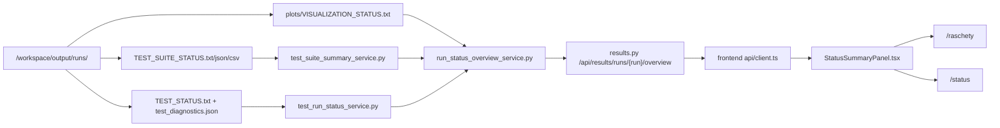

# Контекст для продолжения разработки в новом чате

**Проект:** Влагоперенос в почве  
**Дата фиксации:** 2026-06-28  
**Рабочая папка:** `/home/zenbook/SF/pflotran_soilflow_docker_tested`  
**Git root:** `/home/zenbook/SF`  
**Текущий сервис:** `http://localhost:18080/`  
**Контейнер:** `pflotran_soilflow_docker_tested-soilflow-web-1`  
**Базовый commit перед текущим stability/performance этапом:** `70cbdcf Harden results status artifact handling`
**Статус этого handoff:** предназначен для открытия нового чата Codex без восстановления истории из текущего длинного чата.

## 1. Решение по переходу в новый чат

Переход в новый чат **рекомендуется**.

Обоснование:

- текущий чат уже прошел через автоматическое сжатие контекста;
- история разработки стала длинной и содержит несколько крупных этапов: verification-suite, API статусов, frontend карточки состояния, документация, проверки, hot-copy в контейнер;
- предыдущий крупный status-overview этап уже зафиксирован в `c685e46`;
- инструмент не вернул точный остаток token budget, поэтому надежнее считать контекст рискованным для следующих крупных блоков;
- следующий блок лучше начинать с этого файла, `git status`, `git diff --stat` и повторного smoke/check.

Рациональный порядок:

1. В новом чате сначала прочитать этот файл.
2. Проверить `git status --short`.
3. Проверить, что сервис жив: `curl -fsS http://localhost:18080/api/health/ready`.
4. Продолжать с текущего незакоммиченного smoke/doc этапа, если он есть.
5. После проверок зафиксировать новый малый этап отдельным commit.

## 2. Обязательные рабочие правила окружения

В этой Windows/WSL среде надежнее выполнять repo-команды через WSL:

```bash
wsl -d Ubuntu --cd /home/zenbook/SF/pflotran_soilflow_docker_tested -- <command>
```

Не использовать сырые PowerShell heredoc, сложные pipes, `head`, `true`, shell loops и вложенные кавычки на границе PowerShell/WSL. Уже несколько раз PowerShell перехватывал bash-синтаксис. Для сложных shell-конструкций использовать:

```bash
wsl -d Ubuntu --cd /home/zenbook/SF/pflotran_soilflow_docker_tested -- bash -lc "<команда>"
```

Для правок файлов использовать `apply_patch`. Не выполнять `git reset --hard`, `git clean`, force push, массовое удаление результатов без прямого запроса пользователя.

## 3. Текущее состояние репозитория

Крупный status-overview этап зафиксирован и отправлен в `main` commit'ом:

```text
c685e46 Add typed run status overviews
```

Текущий следующий этап: второй инкремент устойчивости и производительности
results/status layer. Первый инкремент уже перевел `/api/results/runs` в
быстрый summary-режим без рекурсивного сканирования файлов каждой run-папки и
сделал чтение suite/test status artifacts устойчивым к частично записанным
JSON/CSV diagnostics. Второй инкремент добавляет живой performance/stability
smoke и выравнивает JSON-only suite status в summary/overview.

## 4. Что было сделано после последнего commit

### 4.1 Machine-readable suite summary

Добавлен backend reader для `TEST_SUITE_STATUS.json`, `TEST_SUITE_RESULTS.csv` и fallback на `TEST_SUITE_STATUS.txt`.

Ключевой файл:

```text
web/backend/app/services/test_suite_summary_service.py
```

Endpoint:

```text
GET /api/results/runs/{run_name}/test-suite
```

Назначение:

- отдавать verification-suite как JSON DTO;
- не заставлять frontend парсить TXT;
- безопасно читать только status-artifacts внутри run-директории;
- отвергать symlink и слишком крупные artifacts.
- при частично записанном `TEST_SUITE_STATUS.json` откатываться к
  `TEST_SUITE_STATUS.txt`/`TEST_SUITE_RESULTS.csv` и помечать summary как
  `artifact_readiness=PARTIAL`.

### 4.2 Typed test run status

Добавлен backend reader для отдельных `TEST_STATUS.txt` и `test_diagnostics.json`.

Ключевой файл:

```text
web/backend/app/services/test_run_status_service.py
```

Endpoint:

```text
GET /api/results/runs/{run_name}/test-status
```

Назначение:

- отдавать статус отдельного `_test_*` запуска;
- нормализовать `true/false`, integer и float значения;
- сохранять строки без `=` как `messages`;
- подмешивать `test_diagnostics.json`, если он есть.
- при частично записанном или поврежденном `test_diagnostics.json` сохранять
  основной статус из `TEST_STATUS.txt`, а diagnostics помечать
  `artifact_readiness=PARTIAL`.
- если `TEST_STATUS.txt` уже существует, но ключ `TEST_STATUS` еще не записан,
  endpoint возвращает `status=UNKNOWN` и `artifact_readiness=PARTIAL`.

Пример проверенного live endpoint:

```text
GET http://localhost:18080/api/results/runs/_test_linear_darcy/test-status
```

Он возвращал `status=PASS`, `test_id=_test_linear_darcy`, checks `pressure/saturation/flux/solver/warning=PASS`, `comparison_points=80`, `q_error_m_s=4.32116333091e-10`.

### 4.3 Shared status artifact safety

Общий helper:

```text
web/backend/app/services/result_status_artifacts.py
```

Ответственность:

- `status_artifact_path(run_dir, filename)`;
- `existing_status_artifact(...)`;
- `existing_status_artifact_names(...)`;
- `parse_key_value_status(...)`.

Инварианты:

- status artifact не должен быть symlink;
- resolved path должен оставаться внутри разрешенной run-директории;
- artifact size limit: `2 MiB`;
- TXT читается с `encoding=utf-8`, `errors=replace`.

### 4.4 Unified run overview

Добавлен агрегирующий backend service:

```text
web/backend/app/services/run_status_overview_service.py
```

Endpoint:

```text
GET /api/results/runs/{run_name}/overview
```

Назначение:

- собрать единый обзор состояния run-директории;
- если есть suite status, добавить карточку `test-suite`;
- если есть test status, добавить карточку `test-run`;
- если есть `plots/VISUALIZATION_STATUS.txt`, добавить карточку `visualization`;
- если status-файлов нет, вернуть fallback `run-files`.

Проверенный live endpoint:

```text
GET http://localhost:18080/api/results/runs/_test_linear_darcy/overview
```

Возвращал карточки:

```text
test-run: PASS, _test_linear_darcy
visualization: PASS, profiles_animation.html
```

### 4.5 Frontend status cards

Добавлен общий компонент:

```text
web/frontend/src/components/StatusSummaryPanel.tsx
```

Он используется:

- на странице `Расчеты` для выбранного run через `/overview`;
- на странице `Статус` для выбранного job, чтобы job/status/run карточки были в одном визуальном стиле.

Связанные frontend файлы:

```text
web/frontend/src/api/client.ts
web/frontend/src/types.ts
web/frontend/src/pages/ResultsPage.tsx
web/frontend/src/pages/JobsPage.tsx
web/frontend/src/styles.css
```

Важно: в `StatusSummaryPanel.tsx` используется `replace(/_/g, "-")`, не `replaceAll`, потому что текущий TS target не поддержал `String.replaceAll`.

## 5. Backend API после изменений

Существующие endpoints сохранены:

```text
GET /api/results/runs
GET /api/results/runs/{run_name}
GET /api/results/runs/{run_name}/status
GET /api/results/runs/{run_name}/plots
GET /api/results/runs/{run_name}/file/{file_path}
```

Важно: `GET /api/results/runs` теперь является быстрым summary endpoint и не
обязан возвращать список `files` для каждой run-папки. Детальный ограниченный
список файлов остается в `GET /api/results/runs/{run_name}` для выбранного
запуска. Флаг `has_suite_status` считается по JSON/TXT suite artifacts.

Новые/расширенные endpoints:

```text
GET /api/results/runs/{run_name}/test-suite
GET /api/results/runs/{run_name}/test-status
GET /api/results/runs/{run_name}/overview
```

DTO добавлены в:

```text
web/backend/app/schemas.py
```

Новые Pydantic модели:

```text
TestSuiteResult
TestSuiteStatus
TestRunStatus
StatusSummaryMetric
StatusSummaryItem
RunStatusOverview
```

## 6. Frontend после изменений

Страница `Расчеты`:

- показывает сохраненные расчеты и standalone run-папки;
- для выбранного run вызывает `getRunStatusOverview(runName)`;
- показывает `StatusSummaryPanel title="Сводка состояния"`;
- ниже оставляет `ResultFileList`;
- кнопки `Открыть исходные данные`, `Запустить заново`, `Удалить` показываются только для SQLite calculation;
- standalone `_test_*` runs не получают неактивные calculation-кнопки.

Страница `Статус`:

- список jobs прежний;
- выбранный job показывается через `StatusSummaryPanel`;
- log viewer сохранен.

Стили:

```text
.status-summary-panel
.status-card-grid
.status-card
.status-card-header
.status-pill
.status-card-metrics
.status-card-footer
```

## 7. Проверки, выполненные после stability/performance инкремента

Последний полный gate после первого stability/performance инкремента прошел
успешно:

```bash
./scripts/check_project.sh
```

Состав gate:

```text
[1/10] Python compile
[2/10] Backend unit tests
[3/10] Core modular tests
[4/10] Frontend production build
[5/10] Cleanup generated frontend build
[6/10] Restart web service
[7/10] API contract and workflow checks
[8/10] Results performance smoke
[9/10] Restart resilience smoke
[10/10] Frontend route smoke
```

Итог последнего запуска:

```text
Backend unit tests: 21 tests OK
Core tests: 51 tests OK
Frontend production build: OK
API smoke: OK
tabular API workflow smoke: OK
results performance smoke: OK
restart resilience smoke: OK
UI route smoke: OK
project checks passed on http://localhost:18080
```

Также отдельно проверялось:

```bash
python3 -m compileall -q web/backend/app web/backend/tests scripts tests
python3 -m unittest web.backend.tests.test_backend_services -v
python3 -m unittest discover -s tests -v
docker run --rm -v /home/zenbook/SF/pflotran_soilflow_docker_tested:/app -w /app/web/frontend node:20 npm run build
./scripts/sync_to_running_container.sh
curl -fsS http://localhost:18080/api/health/ready
curl -fsS http://localhost:18080/api/results/runs/_test_linear_darcy/overview
WEB_PORT=18080 ./scripts/api_results_performance_smoke.sh
WEB_PORT=18080 ./scripts/api_restart_resilience_smoke.sh
python3 -m compileall -q scripts tests web/backend/app
git diff --check
```

После `check_project.sh` generated local artifacts были очищены:

```bash
git restore -- runs/_test_suite/TEST_SUITE_STATUS.txt
rm -f runs/_test_suite/TEST_SUITE_RESULTS.csv runs/_test_suite/TEST_SUITE_STATUS.json
```

Последний `git diff --check` был чистым.

## 8. Работающий сервис

Текущее состояние контейнера после последней проверки:

```text
pflotran_soilflow_docker_tested-soilflow-web-1 Up
0.0.0.0:18080->8080/tcp
```

Readiness endpoint:

```text
GET http://localhost:18080/api/health/ready
```

Возвращал:

```json
{
  "status": "ready",
  "service": "soilflow-pflotran-web",
  "checks": {
    "pflotran_exe": true,
    "workspace": true,
    "frontend_dist": true,
    "tmp_writable": true,
    "database": true
  },
  "details": {},
  "schema_version": 2
}
```

После stability/performance этапа и текущего strict-readiness/API инкремента
была выполнена релизная сверка через полный Docker rebuild:

```bash
WEB_PORT=18080 BUILD_JOBS=12 docker compose build soilflow-web
WEB_PORT=18080 docker compose up -d --force-recreate soilflow-web
./scripts/check_project.sh
```

Последний подтвержденный image/container id после rebuild:

```text
sha256:b1e0e151f91739f24525e82357e966cc41c4c723a1503e03f0afab95574727a5
```

## 9. Документация, обновленная в этом этапе

```text
CHANGELOG.md
docs/API_CONTRACT_RU.md
docs/EXTERNAL_CONTEXT_RU.md
docs/WEB_INTERFACE_RU.md
docs/NEXT_CHAT_CONTEXT_RU.md
```

Смысл изменений:

- добавлены `/test-suite`, `/test-status`, `/overview`;
- добавлен `scripts/ui_route_smoke.sh` и обязательный `[10/10] Frontend route smoke` в `scripts/check_project.sh`;
- добавлен `scripts/api_results_performance_smoke.sh` и обязательный
  `[8/9] Results performance smoke` в `scripts/check_project.sh`;
- добавлен `scripts/api_restart_resilience_smoke.sh` и обязательный
  `[9/10] Restart resilience smoke` в `scripts/check_project.sh`;
- зафиксировано, что frontend больше не парсит status TXT напрямую;
- описан общий reader status-сводок;
- зафиксировано, что `/api/results/runs` является быстрым summary endpoint без
  рекурсивного списка файлов каждой run-папки;
- JSON-only suite artifacts теперь видны в summary/overview как suite status;
- чтение status artifacts кэшируется по `path + size + mtime_ns`, поэтому
  повторные overview/status запросы на неизменных файлах уменьшают disk I/O;
- overview кэшируется по сигнатуре status artifacts и инвалидируется при
  изменении TXT/JSON/CSV/status-файлов;
- `scripts/api_results_performance_smoke.sh` проверяет лимиты времени ответа и
  размера JSON payload для results endpoints;
- results performance smoke проверяет контракт после restart web-сервиса;
- results performance smoke дополнительно проверяет `/plots`, HTML-график и
  отказ прямой выдачи symlink-файла из run-директории;
- прямые file responses для status/results/visualization централизованы на
  safe-file helper с отказом для symlink, директорий, path escape и слишком
  крупных inline payload;
- restart resilience smoke проверяет перевод active job в `failed`, readiness и
  SQLite schema version после restart;
- `TEST_STATUS.txt` без ключа `TEST_STATUS` получает явный partial marker;
- частично записанные suite/status artifacts больше не должны давать 500 при
  наличии пригодного fallback;
- web smoke examples дополнены curl-командами для новых endpoints.

## 10. Архитектурная карта текущего results/status слоя



## 11. Текущие риски и ограничения

1. Текущий stability/performance diff нужно закоммитить после финальной очистки
   generated artifacts.
2. Docker image пересобран после stability/performance инкремента; при
   следующих значимых изменениях повторить rebuild gate.
3. В `output/runs` и Docker volume есть много generated расчетных результатов; не добавлять их в git.
4. `runs/_test_suite/TEST_SUITE_STATUS.txt` является tracked/generated baseline и может меняться после test dry-runs. После проверок его нужно восстанавливать, если он попал в `git status`.
5. Endpoint `/overview` покрыт unit-тестами и добавлен в `scripts/api_smoke.sh`.
6. Старые endpoints `/test-suite` и `/test-status` оставлены для совместимости и прямого анализа; не удалять их без отдельного решения.

## 12. Рекомендуемый следующий план

### Блок A. Устойчивость runtime и API

Цель: сделать сервис предсказуемым при больших `output/runs`, долгих расчетах,
рестартах контейнера и частичных artifacts.

1. Ввести performance/stability smoke для чтения результатов:
   - уже добавлен `scripts/api_results_performance_smoke.sh`, который измеряет
     `/api/results/runs`, `/overview`, `/test-suite`, `/test-status` на наборе
     временных run-папок и проверяет restart-resilience;
   - лимиты времени ответа и размера JSON уже проверяются smoke-скриптом;
   - фиксировать деградации отдельным скриптом, не смешивая с физикой PFLOTRAN.
2. Ужесточить filesystem-контракты result endpoints:
   - safe-file helper централизован для прямых status/results/visualization
     responses;
   - unit-тесты покрывают traversal, symlink и oversized direct file;
   - symlink, директории, выход за пределы run-директории и слишком крупные
     inline files не отдаются через API.
3. Сделать чтение status/artifacts устойчивым:
   - уже добавлен graceful fallback для поврежденных `TEST_SUITE_STATUS.json`,
     `TEST_SUITE_RESULTS.csv`, `test_diagnostics.json` и частично записанного
     `TEST_STATUS.txt` без ключа `TEST_STATUS`;
   - показывать `UNKNOWN/PARTIAL` вместо 500, если расчет еще пишет файлы;
   - разделить ошибки parser-а и ошибки внешнего solver-а в diagnostics.
4. Проверить restart-resilience:
   - results/status endpoints покрыты `scripts/api_results_performance_smoke.sh`;
   - active job interruption, readiness и SQLite schema после restart покрыты
     `scripts/api_restart_resilience_smoke.sh`.

### Блок B. Производительность backend/frontend

Цель: убрать лишнее полное сканирование файлов и тяжелые повторные вычисления,
оставив поведение API совместимым.

1. Оптимизировать список run'ов и overview:
   - профилировать количество `stat/open/read` при `/api/results/runs`;
   - кэш чтения status artifacts по `mtime`/размеру уже добавлен;
   - кэш агрегированных overview по сигнатуре status artifacts уже добавлен;
   - читать тяжелые artifacts лениво, только для выбранного run.
2. Ограничить размер payload'ов:
   - для списков отдавать summary, а не содержимое больших CSV/TEC;
   - для графиков и profile overlay ввести понятные лимиты/пагинацию или
     downsample, если файл большой;
   - зафиксировать это в API contract и тестах.
3. Ускорить verification artifacts:
   - не пересчитывать аналитические profile rows несколько раз в одном run;
   - вынести повторяющиеся time/profile grids в локальные helpers;
   - добавить regression-тесты на shape/содержимое, чтобы оптимизация не
     изменила физический контракт.
4. Frontend:
   - страница `Графики` уже не запрашивает файлы графиков для run без готовой
     визуализации и обновляется реже;
   - показывать skeleton/partial state вместо блокировки страницы;
   - сохранить русские короткие URL и текущий визуальный язык.

### Блок C. Производительность и устойчивость verification-suite

Цель: сделать suite полезным как быстрый gate и как расширенный физический
прогон, не заставляя каждый раз запускать самый тяжелый сценарий.

1. Разделить проверки по профилям запуска:
   - fast gate реализован как `CHECK_PROFILE=fast ./scripts/check_project.sh`
     и Makefile-цель `project-check-fast`: compile, unit, modular smoke,
     restart, API smoke и UI route smoke;
   - full gate остается `CHECK_PROFILE=full ./scripts/check_project.sh`
     или обычный `./scripts/check_project.sh` плюс Docker rebuild;
   - research gate реализован как `CHECK_PROFILE=research
     ./scripts/check_project.sh` и Makefile-цель `project-check-research`;
     по умолчанию это verification-suite dry-run, solver-heavy режим включается
     через `RESEARCH_DRY_RUN=0` и `RESEARCH_TEST_NAME=<test|all>`.
2. Добавить timeout/diagnostics policy:
   - CLI/PFLOTRAN runner поддерживает `--solver-timeout-seconds` и
     `SOILFLOW_SOLVER_TIMEOUT_SECONDS`;
   - verification-suite пишет `TEST_STATUS=PFLOTRAN_TIMEOUT`, `exit_code=124`,
     `solver_timed_out=true` в metrics и `[TIMEOUT]` marker в log;
   - backend `CommandRunner` при превышении `SOILFLOW_JOB_TIMEOUT_SECONDS`
     возвращает exit code `124` и пишет timeout marker в job log;
   - status diagnostics расширены полем `failure_stage` в `TEST_STATUS.txt`,
     JSON/CSV suite artifacts и API-сводке;
   - generation exceptions больше не обрывают весь suite: отдельный тест
     получает `UNKNOWN` и `failure_stage=generation`, после чего suite summary
     все равно записывается;
   - parser exceptions по TECPLOT/profile artifacts получают
     `failure_stage=parser`; evaluator exceptions после успешного чтения output
     получают `failure_stage=evaluator`; solver timeout/error получает
     `failure_stage=solver`;
   - frontend `Расчеты` показывает таблицу suite results и фильтры по статусу,
     `failure_stage` и `strict_readiness_stage`.
3. Использовать `strict_readiness_stage` для выбора следующего блока:
   - suite writer теперь создает `STRICT_READINESS_PLAN.json` с `stage_order`,
     `next_stage`, `next_targets`, blocker-полями и списком candidates для
     машинного выбора следующего strict-readiness блока;
   - backend `/test-suite` отдает `strict_readiness_plan`, а `/overview`
     показывает следующий strict-блок, первый target и blocker в карточке suite;
   - сначала закрывать `DECK_ADAPTER_PENDING` для `richards_mms`;
   - затем `CASE_BUILDER_PENDING` для heat/transport/groundwater;
   - затем `STRICT_EVALUATOR_PENDING` для infiltration/profile carrier.
4. Не повышать `profile_smoke` до strict gate без физического deck/evaluator и
   явного `strict_candidate_can_gate_suite=true`.

### Блок D. Следующие физические модели

Опорный уже выполненный архитектурный слой:

- добавлен `profile_benchmark_evaluators.py` для диагностической оценки
  `REFERENCE_OVERLAY` profile-smoke benchmark'ов;
- добавлен `profile_benchmark_cases.py` с физическими семействами, carrier
  readiness и blocker'ами будущих strict evaluator'ов;
- profile benchmark generation теперь пишет `profile_case_manifest.json` с
  `profile_deck_kind`, `strict_candidate_can_gate_suite` и
  `strict_readiness_stage`;
- profile benchmark generation теперь также пишет `profile_strict_plan.json`
  как machine-readable план подключения strict evaluator-а;
- добавлен `profile_strict_evaluators.py` с первым strict-кандидатом
  `richards_mms` по RMSE/max-error напора и влажности;
- добавлен `richards_mms_case.py`: `richards_mms` генерирует uniform storage
  `SOURCE_SINK`/`RATE LIST` candidate deck и artifacts
  `richards_mms_initial_profile.csv`, `richards_mms_source_rate.csv`,
  `richards_mms_spatial_source_profile.csv`,
  `richards_mms_spatial_source_matrix.json`,
  `richards_mms_spatial_source_manifest.json`;
- `TEST_STATUS.txt` profile benchmark'ов теперь может содержать
  `profile_evaluator=reference_overlay`, `strict_profile_evaluator` и
  `profile_overlay_quality_check`, `profile_physics_family`,
  `profile_carrier_status`;
- для `richards_mms` значение strict evaluator readiness остается
  `EVALUATOR_READY_DECK_PENDING`: evaluator готов, uniform source-term candidate
  и cell-wise matrix/manifest artifacts есть, но strict gate ждет PFLOTRAN adapter
  для spatial MMS source-term и nonuniform initial profile;
- profile status для `richards_mms` уже публикует
  `richards_mms_adapter_artifact_check`, а `analytical_test_summary.txt`
  содержит readiness matrix/manifest artifacts и pending deck adapter status;
- `strict_candidate_can_gate_suite=false` сохраняет strict-кандидат
  диагностическим до замены carrier deck'а физической MMS постановкой;
- suite CSV расширен колонками качества overlay, blocker-полями и pending
  strict evaluator;
- suite summary агрегирует strict-readiness stages в счетчики
  `strict_gate_ready_total`, `strict_deck_adapter_pending_total`,
  `strict_case_builder_pending_total`, `strict_evaluator_pending_total`;
- физические strict-evaluator'ы для Theis/Ogata/Terzaghi/heat/Buckley/
  Boussinesq/Richards MMS еще не подключены;
- полный Docker rebuild gate выполнен после strict-readiness/API инкремента;
- затем переходить к следующей физической/исследовательской модели.

## 13. Что нельзя потерять

- XLSX не должен вернуться как внутреннее хранилище исходных данных.
- PFLOTRAN остается заменяемым solver adapter, не смешивать solver logic с frontend/API.
- Новые status endpoints не должны читать произвольные файлы вне run-директории.
- Новые UI элементы должны быть на русском языке.
- Короткие URL должны сохраняться:

```text
/ishodnye
/status
/testy
/raschety
/grafiki
/sistema
```

- Для новых тестов сохранять уровни:

```text
strict_analytical
partial_balance
profile_smoke
workflow_smoke
```

## 14. Минимальная инструкция для нового чата

Новый чат можно начать так:

```text
Работай в проекте /home/zenbook/SF/pflotran_soilflow_docker_tested.
Сначала прочитай docs/NEXT_CHAT_CONTEXT_RU.md и docs/EXTERNAL_CONTEXT_RU.md.
Проверь git status и текущее состояние сервиса.
Дальше продолжай с блока: если второй stability/performance этап не закоммичен,
проверить `git status`, запустить `./scripts/check_project.sh`, выполнить Docker
rebuild gate, очистить generated artifacts `runs/_test_suite`, затем
commit/push.
Работай через WSL bash, не через PowerShell heredoc/pipes.
```
