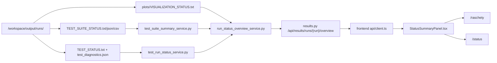

# Контекст для продолжения разработки в новом чате

**Проект:** Влагоперенос в почве  
**Дата фиксации:** 2026-06-28  
**Рабочая папка:** `/home/zenbook/SF/pflotran_soilflow_docker_tested`  
**Git root:** `/home/zenbook/SF`  
**Текущий сервис:** `http://localhost:18080/`  
**Контейнер:** `pflotran_soilflow_docker_tested-soilflow-web-1`  
**Последний commit в HEAD:** `fba8ebe Refactor verification suite modules`  
**Статус этого handoff:** предназначен для открытия нового чата Codex без восстановления истории из текущего длинного чата.

## 1. Решение по переходу в новый чат

Переход в новый чат **рекомендуется**.

Обоснование:

- текущий чат уже прошел через автоматическое сжатие контекста;
- история разработки стала длинной и содержит несколько крупных этапов: verification-suite, API статусов, frontend карточки состояния, документация, проверки, hot-copy в контейнер;
- в рабочем дереве есть крупный незакоммиченный diff, который важно не потерять и не смешать с новым этапом;
- инструмент не вернул точный остаток token budget, поэтому надежнее считать контекст рискованным для следующих крупных блоков;
- следующий блок лучше начинать с этого файла, `git status`, `git diff --stat` и повторного smoke/check.

Рациональный порядок:

1. В новом чате сначала прочитать этот файл.
2. Проверить `git status --short`.
3. Проверить, что сервис жив: `curl -fsS http://localhost:18080/api/health/ready`.
4. Если пользователь хочет зафиксировать текущий этап, сделать commit/push.
5. Потом продолжать следующий крупный блок.

## 2. Обязательные рабочие правила окружения

В этой Windows/WSL среде надежнее выполнять repo-команды через WSL:

```bash
wsl -d Ubuntu --cd /home/zenbook/SF/pflotran_soilflow_docker_tested -- <command>
```

Не использовать сырые PowerShell heredoc, сложные pipes, `head`, `true`, shell loops и вложенные кавычки на границе PowerShell/WSL. Уже несколько раз PowerShell перехватывал bash-синтаксис. Для сложных shell-конструкций использовать:

```bash
wsl -d Ubuntu --cd /home/zenbook/SF/pflotran_soilflow_docker_tested -- bash -lc "<команда>"
```

Для правок файлов использовать `apply_patch`. Не выполнять `git reset --hard`, `git clean`, force push, массовое удаление результатов без прямого запроса пользователя.

## 3. Текущее состояние репозитория

На момент фиксации контекста рабочее дерево не закоммичено. Последний известный `git status --short`:

```text
 M CHANGELOG.md
 M docs/API_CONTRACT_RU.md
 M docs/EXTERNAL_CONTEXT_RU.md
 M docs/WEB_INTERFACE_RU.md
 M web/backend/app/routers/results.py
 M web/backend/app/schemas.py
 M web/backend/tests/test_backend_services.py
 M web/frontend/src/api/client.ts
 M web/frontend/src/pages/JobsPage.tsx
 M web/frontend/src/pages/ResultsPage.tsx
 M web/frontend/src/styles.css
 M web/frontend/src/types.ts
?? web/backend/app/services/result_status_artifacts.py
?? web/backend/app/services/run_status_overview_service.py
?? web/backend/app/services/test_run_status_service.py
?? web/backend/app/services/test_suite_summary_service.py
?? web/frontend/src/components/StatusSummaryPanel.tsx
```

Последний известный `git diff --stat`:

```text
 pflotran_soilflow_docker_tested/CHANGELOG.md       |   2 +
 .../docs/API_CONTRACT_RU.md                        |   8 +
 .../docs/EXTERNAL_CONTEXT_RU.md                    |   4 +-
 .../docs/WEB_INTERFACE_RU.md                       |   3 +
 .../web/backend/app/routers/results.py             |  43 +++++-
 .../web/backend/app/schemas.py                     |  49 ++++++
 .../web/backend/tests/test_backend_services.py     | 165 ++++++++++++++++++++
 .../web/frontend/src/api/client.ts                 |  17 ++-
 .../web/frontend/src/pages/JobsPage.tsx            |  37 +++--
 .../web/frontend/src/pages/ResultsPage.tsx         | 105 +++++++++++--
 .../web/frontend/src/styles.css                    | 168 +++++++++++++++++++++
 .../web/frontend/src/types.ts                      |  49 ++++++
 12 files changed, 624 insertions(+), 26 deletions(-)
```

В diff-stat не отображены untracked файлы как отдельные строки, но они входят в текущий незакоммиченный этап и должны быть добавлены при commit.

## 4. Что было сделано после последнего commit

### 4.1 Machine-readable suite summary

Добавлен backend reader для `TEST_SUITE_STATUS.json`, `TEST_SUITE_RESULTS.csv` и fallback на `TEST_SUITE_STATUS.txt`.

Ключевой файл:

```text
web/backend/app/services/test_suite_summary_service.py
```

Endpoint:

```text
GET /api/results/runs/{run_name}/test-suite
```

Назначение:

- отдавать verification-suite как JSON DTO;
- не заставлять frontend парсить TXT;
- безопасно читать только status-artifacts внутри run-директории;
- отвергать symlink и слишком крупные artifacts.

### 4.2 Typed test run status

Добавлен backend reader для отдельных `TEST_STATUS.txt` и `test_diagnostics.json`.

Ключевой файл:

```text
web/backend/app/services/test_run_status_service.py
```

Endpoint:

```text
GET /api/results/runs/{run_name}/test-status
```

Назначение:

- отдавать статус отдельного `_test_*` запуска;
- нормализовать `true/false`, integer и float значения;
- сохранять строки без `=` как `messages`;
- подмешивать `test_diagnostics.json`, если он есть.

Пример проверенного live endpoint:

```text
GET http://localhost:18080/api/results/runs/_test_linear_darcy/test-status
```

Он возвращал `status=PASS`, `test_id=_test_linear_darcy`, checks `pressure/saturation/flux/solver/warning=PASS`, `comparison_points=80`, `q_error_m_s=4.32116333091e-10`.

### 4.3 Shared status artifact safety

Общий helper:

```text
web/backend/app/services/result_status_artifacts.py
```

Ответственность:

- `status_artifact_path(run_dir, filename)`;
- `existing_status_artifact(...)`;
- `existing_status_artifact_names(...)`;
- `parse_key_value_status(...)`.

Инварианты:

- status artifact не должен быть symlink;
- resolved path должен оставаться внутри разрешенной run-директории;
- artifact size limit: `2 MiB`;
- TXT читается с `encoding=utf-8`, `errors=replace`.

### 4.4 Unified run overview

Добавлен агрегирующий backend service:

```text
web/backend/app/services/run_status_overview_service.py
```

Endpoint:

```text
GET /api/results/runs/{run_name}/overview
```

Назначение:

- собрать единый обзор состояния run-директории;
- если есть suite status, добавить карточку `test-suite`;
- если есть test status, добавить карточку `test-run`;
- если есть `plots/VISUALIZATION_STATUS.txt`, добавить карточку `visualization`;
- если status-файлов нет, вернуть fallback `run-files`.

Проверенный live endpoint:

```text
GET http://localhost:18080/api/results/runs/_test_linear_darcy/overview
```

Возвращал карточки:

```text
test-run: PASS, _test_linear_darcy
visualization: PASS, profiles_animation.html
```

### 4.5 Frontend status cards

Добавлен общий компонент:

```text
web/frontend/src/components/StatusSummaryPanel.tsx
```

Он используется:

- на странице `Расчеты` для выбранного run через `/overview`;
- на странице `Статус` для выбранного job, чтобы job/status/run карточки были в одном визуальном стиле.

Связанные frontend файлы:

```text
web/frontend/src/api/client.ts
web/frontend/src/types.ts
web/frontend/src/pages/ResultsPage.tsx
web/frontend/src/pages/JobsPage.tsx
web/frontend/src/styles.css
```

Важно: в `StatusSummaryPanel.tsx` используется `replace(/_/g, "-")`, не `replaceAll`, потому что текущий TS target не поддержал `String.replaceAll`.

## 5. Backend API после изменений

Существующие endpoints сохранены:

```text
GET /api/results/runs
GET /api/results/runs/{run_name}
GET /api/results/runs/{run_name}/status
GET /api/results/runs/{run_name}/plots
GET /api/results/runs/{run_name}/file/{file_path}
```

Новые/расширенные endpoints:

```text
GET /api/results/runs/{run_name}/test-suite
GET /api/results/runs/{run_name}/test-status
GET /api/results/runs/{run_name}/overview
```

DTO добавлены в:

```text
web/backend/app/schemas.py
```

Новые Pydantic модели:

```text
TestSuiteResult
TestSuiteStatus
TestRunStatus
StatusSummaryMetric
StatusSummaryItem
RunStatusOverview
```

## 6. Frontend после изменений

Страница `Расчеты`:

- показывает сохраненные расчеты и standalone run-папки;
- для выбранного run вызывает `getRunStatusOverview(runName)`;
- показывает `StatusSummaryPanel title="Сводка состояния"`;
- ниже оставляет `ResultFileList`;
- кнопки `Открыть исходные данные`, `Запустить заново`, `Удалить` показываются только для SQLite calculation;
- standalone `_test_*` runs не получают неактивные calculation-кнопки.

Страница `Статус`:

- список jobs прежний;
- выбранный job показывается через `StatusSummaryPanel`;
- log viewer сохранен.

Стили:

```text
.status-summary-panel
.status-card-grid
.status-card
.status-card-header
.status-pill
.status-card-metrics
.status-card-footer
```

## 7. Проверки, выполненные после изменений

Последний полный gate прошел успешно:

```bash
./scripts/check_project.sh
```

Состав gate:

```text
[1/7] Python compile
[2/7] Backend unit tests
[3/7] Modular scenario smoke
[4/7] Frontend production build
[5/7] Cleanup generated frontend build
[6/7] Restart web service
[7/7] API contract and workflow checks
```

Итог последнего запуска:

```text
Backend unit tests: 16 tests OK
Core tests: 46 tests OK
Frontend production build: OK
API smoke: OK
tabular API workflow smoke: OK
project checks passed on http://localhost:18080
```

Также отдельно проверялось:

```bash
python3 -m compileall -q web/backend/app web/backend/tests scripts tests
python3 -m unittest discover -s web/backend/tests -v
python3 -m unittest discover -s tests -v
docker run --rm -v /home/zenbook/SF/pflotran_soilflow_docker_tested:/app -w /app/web/frontend node:20 npm run build
./scripts/sync_to_running_container.sh
curl -fsS http://localhost:18080/api/health/ready
curl -fsS http://localhost:18080/api/results/runs/_test_linear_darcy/overview
```

После `check_project.sh` generated local artifacts были очищены:

```bash
git restore -- runs/_test_suite/TEST_SUITE_STATUS.txt
rm -f runs/_test_suite/TEST_SUITE_RESULTS.csv runs/_test_suite/TEST_SUITE_STATUS.json
```

Последний `git diff --check` был чистым.

## 8. Работающий сервис

Текущее состояние контейнера после последней проверки:

```text
pflotran_soilflow_docker_tested-soilflow-web-1 Up
0.0.0.0:18080->8080/tcp
```

Readiness endpoint:

```text
GET http://localhost:18080/api/health/ready
```

Возвращал:

```json
{
  "status": "ready",
  "service": "soilflow-pflotran-web",
  "checks": {
    "pflotran_exe": true,
    "workspace": true,
    "frontend_dist": true,
    "tmp_writable": true,
    "database": true
  },
  "details": {},
  "schema_version": 2
}
```

Важно: изменения синхронизировались в работающий контейнер через:

```bash
./scripts/sync_to_running_container.sh
```

Полная пересборка Docker image не выполнялась на этом этапе. Для релизной фиксации позже желательно сделать полный build, но это может быть долгим из-за PETSc/MPICH/PFLOTRAN.

## 9. Документация, обновленная в этом этапе

```text
CHANGELOG.md
docs/API_CONTRACT_RU.md
docs/EXTERNAL_CONTEXT_RU.md
docs/WEB_INTERFACE_RU.md
```

Смысл изменений:

- добавлены `/test-suite`, `/test-status`, `/overview`;
- зафиксировано, что frontend больше не парсит status TXT напрямую;
- описан общий reader status-сводок;
- web smoke examples дополнены curl-командами для новых endpoints.

## 10. Архитектурная карта текущего results/status слоя



## 11. Текущие риски и ограничения

1. Накопленный diff еще не закоммичен.
2. Docker image может отставать от исходников, потому что использовался hot-copy workflow.
3. В `output/runs` и Docker volume есть много generated расчетных результатов; не добавлять их в git.
4. `runs/_test_suite/TEST_SUITE_STATUS.txt` является tracked/generated baseline и может меняться после test dry-runs. После проверок его нужно восстанавливать, если он попал в `git status`.
5. Endpoint `/overview` уже покрыт unit-тестами, но `scripts/api_smoke.sh` еще не проверяет его явно. Это лучший следующий малый шаг.
6. Старые endpoints `/test-suite` и `/test-status` оставлены для совместимости и прямого анализа; не удалять их без отдельного решения.

## 12. Рекомендуемый следующий план

### Блок A. Зафиксировать текущий этап

1. Проверить:

```bash
wsl -d Ubuntu --cd /home/zenbook/SF/pflotran_soilflow_docker_tested -- git status --short
wsl -d Ubuntu --cd /home/zenbook/SF/pflotran_soilflow_docker_tested -- git diff --check
wsl -d Ubuntu --cd /home/zenbook/SF/pflotran_soilflow_docker_tested -- ./scripts/check_project.sh
```

2. Очистить generated artifacts, если появились:

```bash
wsl -d Ubuntu --cd /home/zenbook/SF/pflotran_soilflow_docker_tested -- git restore -- runs/_test_suite/TEST_SUITE_STATUS.txt
wsl -d Ubuntu --cd /home/zenbook/SF/pflotran_soilflow_docker_tested -- rm -f runs/_test_suite/TEST_SUITE_RESULTS.csv runs/_test_suite/TEST_SUITE_STATUS.json
```

3. Commit/push, если пользователь подтвердит:

```bash
git add CHANGELOG.md docs/API_CONTRACT_RU.md docs/EXTERNAL_CONTEXT_RU.md docs/WEB_INTERFACE_RU.md docs/NEXT_CHAT_CONTEXT_RU.md web/backend/app/routers/results.py web/backend/app/schemas.py web/backend/tests/test_backend_services.py web/backend/app/services/result_status_artifacts.py web/backend/app/services/run_status_overview_service.py web/backend/app/services/test_run_status_service.py web/backend/app/services/test_suite_summary_service.py web/frontend/src/api/client.ts web/frontend/src/components/StatusSummaryPanel.tsx web/frontend/src/pages/JobsPage.tsx web/frontend/src/pages/ResultsPage.tsx web/frontend/src/styles.css web/frontend/src/types.ts
git commit -m "Add typed run status overviews"
git push
```

### Блок B. Добавить smoke для overview

Добавить в `scripts/api_smoke.sh` read-only проверки:

```bash
curl -fsS "$BASE_URL/api/results/runs" >/dev/null
curl -fsS "$BASE_URL/api/results/runs/_test_linear_darcy/overview" >/dev/null || true
```

Лучше не завязываться жестко на `_test_linear_darcy`, если run отсутствует в свежем volume. Более устойчивый вариант:

- получить первый run с `has_test_status` или `has_visualization`;
- проверить `/overview` для него;
- если runs пустой, пропустить с понятным сообщением.

### Блок C. UI smoke

После API smoke можно добавить минимальный browser/API smoke для `/raschety`:

- открыть `http://localhost:18080/raschety`;
- проверить заголовок `Расчеты`;
- если есть `_test_suite` или `_test_linear_darcy`, выбрать run и проверить `Сводка состояния`;
- не делать это обязательным в shell CI, если нет Playwright зависимости.

### Блок D. Следующий архитектурный шаг

После фиксации status overview можно продолжать:

- добавить строгие evaluator-модули для profile-smoke benchmarks;
- расширить `api_smoke.sh` и документацию;
- подготовить полный Docker rebuild gate перед release;
- затем переходить к следующей физической/исследовательской модели.

## 13. Что нельзя потерять

- XLSX не должен вернуться как внутреннее хранилище исходных данных.
- PFLOTRAN остается заменяемым solver adapter, не смешивать solver logic с frontend/API.
- Новые status endpoints не должны читать произвольные файлы вне run-директории.
- Новые UI элементы должны быть на русском языке.
- Короткие URL должны сохраняться:

```text
/ishodnye
/status
/testy
/raschety
/grafiki
/sistema
```

- Для новых тестов сохранять уровни:

```text
strict_analytical
partial_balance
profile_smoke
workflow_smoke
```

## 14. Минимальная инструкция для нового чата

Новый чат можно начать так:

```text
Работай в проекте /home/zenbook/SF/pflotran_soilflow_docker_tested.
Сначала прочитай docs/NEXT_CHAT_CONTEXT_RU.md и docs/EXTERNAL_CONTEXT_RU.md.
Проверь git status и текущее состояние сервиса.
Дальше продолжай с блока: добавить API smoke для /overview, затем check_project.sh, затем подготовить commit/push.
Работай через WSL bash, не через PowerShell heredoc/pipes.
```

