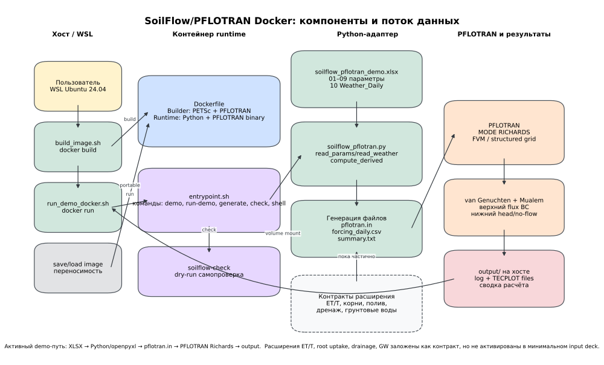
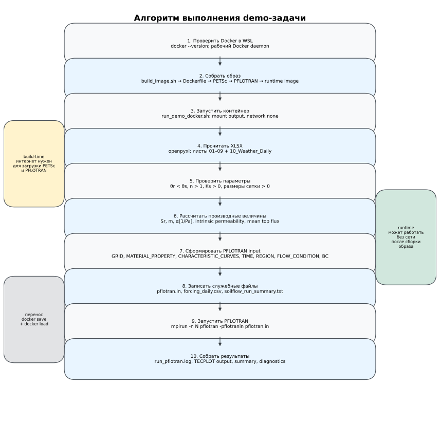
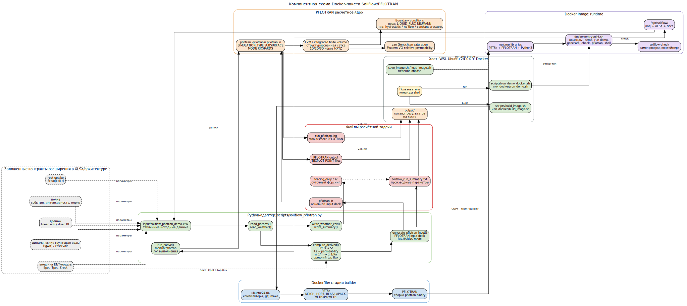
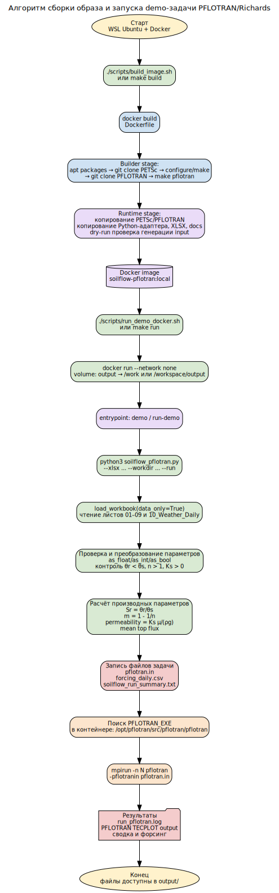
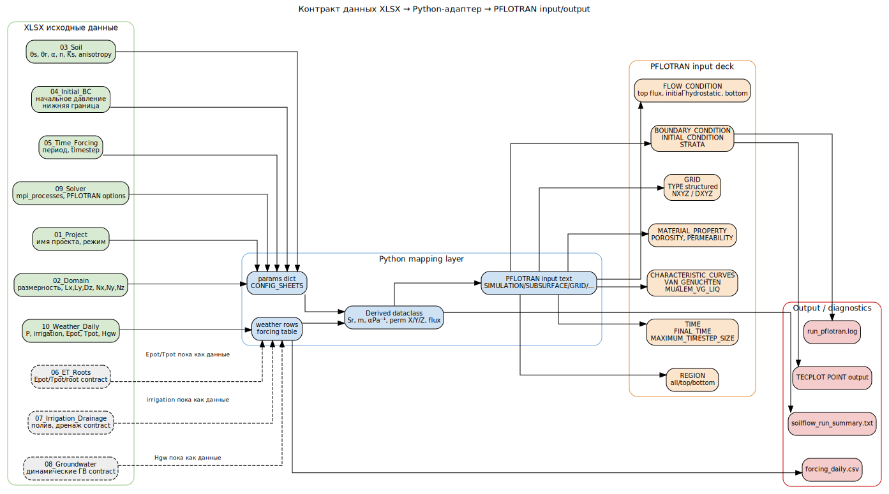
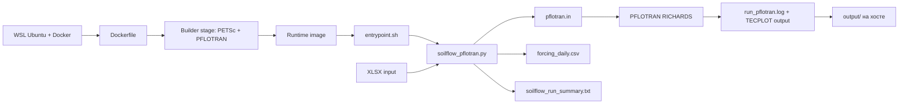
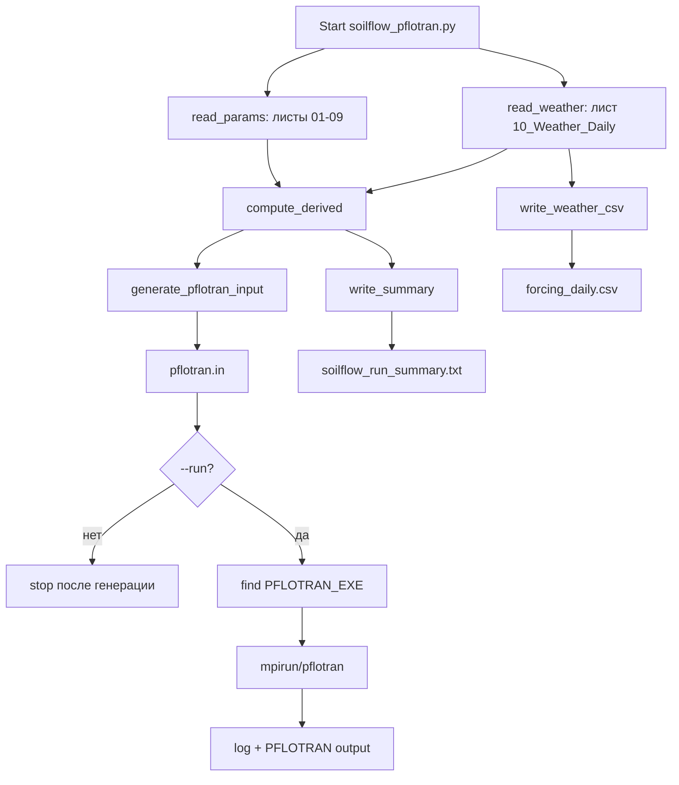

# Графическая схема алгоритма и компонентов SoilFlow/PFLOTRAN Docker-пакета

Этот документ описывает текущий демонстрационный код Docker-пакета: сборку контейнера, Python-адаптер, XLSX-контракт, генерацию `pflotran.in` и запуск PFLOTRAN в режиме `RICHARDS`.

## 0. Обзорная схема, удобная для чтения



PNG-версия: [`schema_overview_clean.png`](schema_overview_clean.png)



PNG-версия: [`schema_algorithm_clean.png`](schema_algorithm_clean.png)


## 1. Компонентная схема



PNG-версия: [`schema_components.png`](schema_components.png)

## 2. Алгоритм сборки и запуска demo-задачи



PNG-версия: [`schema_algorithm.png`](schema_algorithm.png)

## 3. Контракт данных XLSX → PFLOTRAN



PNG-версия: [`schema_data_contract.png`](schema_data_contract.png)

## 4. Что реально активно в текущем demo-коде

Активный расчётный путь:

```text
XLSX → Python/openpyxl → производные параметры → pflotran.in → PFLOTRAN RICHARDS → output/log
```

Активные физические элементы текущего demo:

```text
1. structured grid 1D/2D/3D через NXYZ;
2. RICHARDS mode;
3. van Genuchten saturation function;
4. Mualem VG relative permeability;
5. верхний Neumann flux boundary;
6. нижний режим: hydrostatic / no-flow / constant pressure;
7. начальное hydrostatic pressure condition;
8. TECPLOT POINT output.
```

Заложено как контракт расширения, но в минимальном `pflotran.in` пока не активировано как полноценные time-dependent source/sink или boundary conditions:

```text
1. внешняя модель испарения и транспирации;
2. распределённое корневое водопотребление;
3. динамические грунтовые воды;
4. дренаж;
5. событийный полив с внутрисуточной динамикой.
```

## 5. Упрощённая Mermaid-схема



## 6. Алгоритм Python-адаптера


